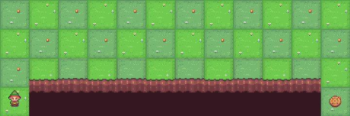
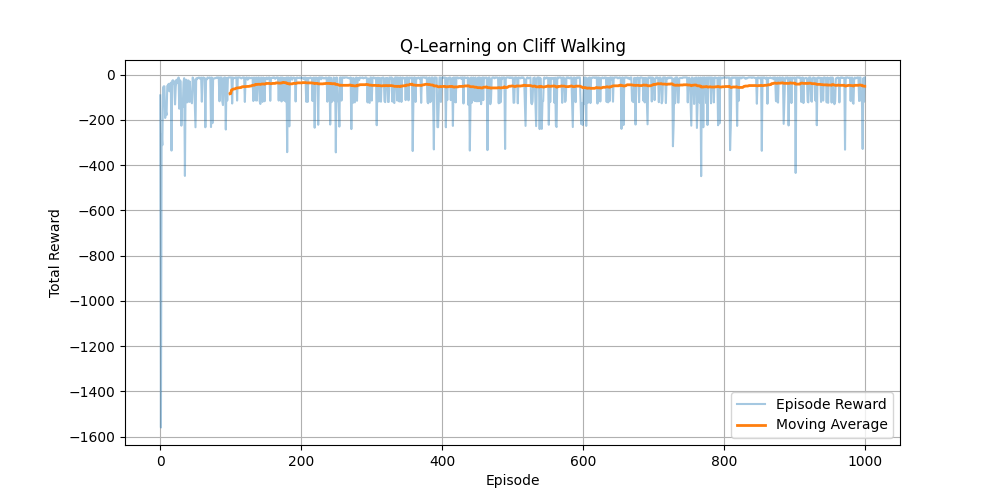
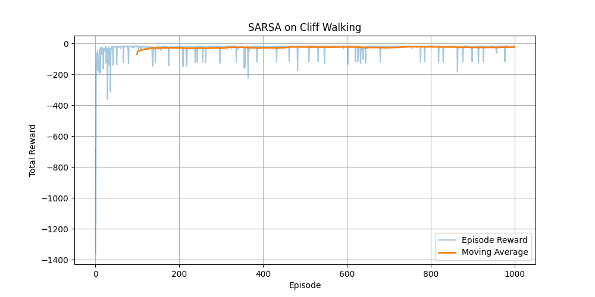
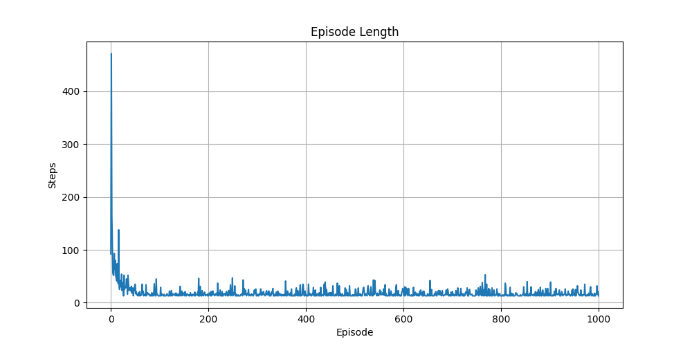
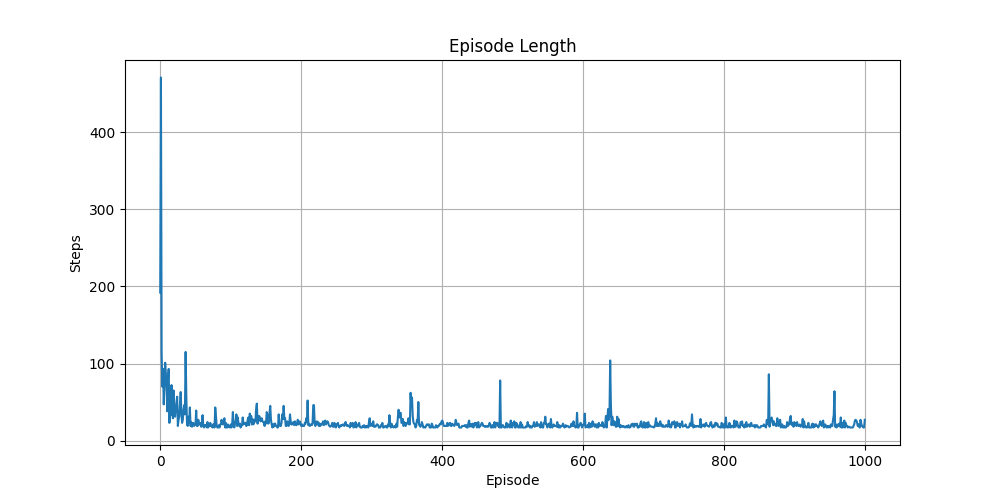

# Reinforcement Learning: Cliff Walking (Gymnasium)

Implementation of the classic Cliff Walking environment using two Temporal Difference (TD) reinforcement learning algorithms:
* **Q-Learning** (Off-Policy)
* **SARSA** (On-Policy)

The objective is to compare how both algorithms learn to navigate the environment while maximizing cumulative reward. Although both eventually reach the goal, they learn noticeably different policies because of their update mechanisms.

## Environment

The project uses Gymnasium's `CliffWalking-v1` environment.
* The agent starts at the bottom-left corner and must reach the goal at the bottom-right corner.
* Stepping into the cliff gives a large negative reward (-100) and resets the agent to the start.
* Every normal move receives a small negative reward (-1).
* The objective is to maximize cumulative reward while reaching the goal efficiently.

---

## Algorithms

### Q-Learning
Q-Learning is an off-policy reinforcement learning algorithm. It updates its Q-values using the maximum estimated value of the next state, allowing it to learn the optimal path regardless of the exploratory action actually taken.

#### Demonstration


### SARSA
SARSA is an on-policy reinforcement learning algorithm. Instead of assuming the best possible next action, it updates the Q-value using the action that the agent *actually* follows according to its $\epsilon$-greedy policy. This produces safer behavior in risky environments.

#### Demonstration


---

## Hyperparameters

| Parameter | Value |
| :--- | :--- |
| Episodes | 1000 |
| Learning Rate ($\alpha$) | 0.5 |
| Discount Factor ($\gamma$) | 0.99 |
| Exploration Rate ($\epsilon$) | 0.1 |

---

## Q-Learning vs SARSA

| Feature | Q-Learning | SARSA |
| :--- | :--- | :--- |
| **Learning Type** | Off-Policy | On-Policy |
| **Update Rule** | Uses max Q-value of next state | Uses next action actually taken |
| **Exploration** | More aggressive | More conservative |
| **Learned Policy** | Shortest path right along the cliff | Safer path looping away from the cliff |
| **Risk** | Higher | Lower |

### Performance Metrics

#### 1. Cumulative Rewards
SARSA tends to maintain a higher and more stable moving average reward during training because its update rule accounts for random exploratory missteps into the cliff. Q-learning optimization ignores exploration risk during updates, frequently falling into the cliff while training, but yields the absolute shortest path at evaluation.

| Q-Learning Rewards | SARSA Rewards |
| :---: | :---: |
|  |  |

#### 2. Episode Length (Steps)
Q-learning optimizes for the minimum possible steps (13 steps) along the cliff edge. SARSA optimizes for safety, accepting a slightly longer path to avoid the penalty zone.

| Q-Learning Steps | SARSA Steps |
| :---: | :---: |
|  |  |

---

## Project Structure

```text
Reinforcement-Learning-CliffWalking/
│
├── q_learning.py
├── sarsa.py
├── requirements.txt
├── LICENSE
├── README.md
└── media/
    ├── qlearning.gif
    ├── sarsa.gif
    ├── qlearning_rewards.png
    ├── qlearning_steps.png
    ├── sarsa_rewards.png
    └── sarsa_steps.png

```

---

# Installation

Clone the repository

```bash
git clone https://github.com/ConquiMomo/Reinforcement-Learning-CliffWalking.git
```

Move into the project directory

```bash
cd Reinforcement-Learning-CliffWalking
```

Install the required dependencies

```bash
pip install -r requirements.txt
```

---

# Usage

Run the Q-Learning implementation

```bash
python q_learning.py
```

Run the SARSA implementation

```bash
python sarsa.py
```

---

# Requirements

- Python 3.10+
- Gymnasium
- NumPy
- Matplotlib

Install using

```bash
pip install -r requirements.txt
```

---

# Learning Outcomes

This project demonstrates:

- Reinforcement Learning fundamentals
- Temporal Difference Learning
- Q-Learning
- SARSA
- Exploration vs Exploitation
- Policy Learning
- Gymnasium Environment Interaction

---

## Future Improvements

- [x] Plot cumulative reward over training episodes
- [x] Compare convergence of both algorithms
- [ ] Tune hyperparameters
- [ ] Implement Expected SARSA
- [ ] Extend to larger GridWorld environments

---
